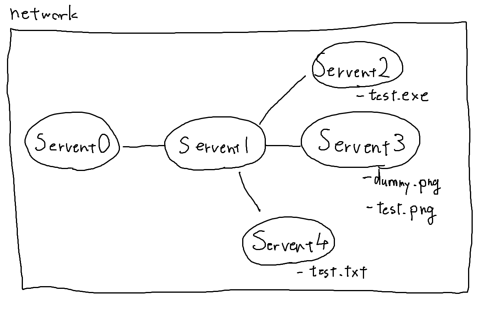

python3.10.1で実装

`python gnutella.py`で実行

# Ping-Pong

```
# ネットワークの詳細
<GnutellaNetwork: [<Servent: 0>, <Servent: 1>, <Servent: 2>, <Servent: 3>]>
<Servent: 0> has neighbor: {<Servent: 1>}
<Servent: 1> has neighbor: {<Servent: 0>, <Servent: 3>, <Servent: 2>}
<Servent: 2> has neighbor: {<Servent: 1>}
<Servent: 3> has neighbor: {<Servent: 1>}

# Servent0からServent1へPINGを送信
INFO:__main__:<Servent: 0> send <Descripter 0 PayloadDescripter.PING ttl: 2 hops: 0> to <Servent: 1>
INFO:__main__:<Servent: 1> receive <Descripter 0 PayloadDescripter.PING ttl: 1 hops: 1> from <Servent: 0>
INFO:__main__:<Servent: 1> send <Descripter 0 PayloadDescripter.PONG ttl: 2 hops: 0> to <Servent: 0>
INFO:__main__:<Servent: 0> receive <Descripter 0 PayloadDescripter.PONG ttl: 1 hops: 1> from <Servent: 1>
INFO:__main__:<Servent: 1> send <Descripter 0 PayloadDescripter.PING ttl: 1 hops: 1> to <Servent: 3>
INFO:__main__:<Servent: 3> receive <Descripter 0 PayloadDescripter.PING ttl: 0 hops: 2> from <Servent: 1>
INFO:__main__:<Servent: 3> send <Descripter 0 PayloadDescripter.PONG ttl: 2 hops: 0> to <Servent: 1>
INFO:__main__:<Servent: 1> receive <Descripter 0 PayloadDescripter.PONG ttl: 1 hops: 1> from <Servent: 3>
INFO:__main__:<Servent: 1> send <Descripter 0 PayloadDescripter.PONG ttl: 1 hops: 1> to <Servent: 0>
INFO:__main__:<Servent: 0> receive <Descripter 0 PayloadDescripter.PONG ttl: 0 hops: 2> from <Servent: 1>
INFO:__main__:<Servent: 1> send <Descripter 0 PayloadDescripter.PING ttl: 1 hops: 1> to <Servent: 2>
INFO:__main__:<Servent: 2> receive <Descripter 0 PayloadDescripter.PING ttl: 0 hops: 2> from <Servent: 1>
INFO:__main__:<Servent: 2> send <Descripter 0 PayloadDescripter.PONG ttl: 2 hops: 0> to <Servent: 1>
INFO:__main__:<Servent: 1> receive <Descripter 0 PayloadDescripter.PONG ttl: 1 hops: 1> from <Servent: 2>
INFO:__main__:<Servent: 1> send <Descripter 0 PayloadDescripter.PONG ttl: 1 hops: 1> to <Servent: 0>
INFO:__main__:<Servent: 0> receive <Descripter 0 PayloadDescripter.PONG ttl: 0 hops: 2> from <Servent: 1>

# PING後のServent0の知っているServentを表示
<Servent: 0> has neighbor: {<Servent: 3>, <Servent: 2>, <Servent: 1>}
```

# Query-QueryHit-Push

```
# Servent0からServent1へQUERYを送信 (検索文字列 "test")
# QUERYを受信したServentは文字列を含むファイル名が存在するか検索
INFO:__main__:<Servent: 0> send <Descripter 0 PayloadDescripter.QUERY ttl: 2 hops: 0> to <Servent: 1>
INFO:__main__:<Servent: 1> receive <Descripter 0 PayloadDescripter.QUERY ttl: 1 hops: 1> from <Servent: 0>
INFO:__main__:<Servent: 1> send <Descripter 0 PayloadDescripter.QUERY ttl: 1 hops: 1> to <Servent: 3>
INFO:__main__:<Servent: 3> receive <Descripter 0 PayloadDescripter.QUERY ttl: 0 hops: 2> from <Servent: 1>
INFO:__main__:<Servent: 3> send <Descripter 0 PayloadDescripter.QUERY_HIT ttl: 2 hops: 0> to <Servent: 1>
INFO:__main__:<Servent: 1> receive <Descripter 0 PayloadDescripter.QUERY_HIT ttl: 1 hops: 1> from <Servent: 3>
INFO:__main__:<Servent: 1> send <Descripter 0 PayloadDescripter.QUERY_HIT ttl: 1 hops: 1> to <Servent: 0>
INFO:__main__:<Servent: 0> receive <Descripter 0 PayloadDescripter.QUERY_HIT ttl: 0 hops: 2> from <Servent: 1>
INFO:__main__:<Servent: 1> send <Descripter 0 PayloadDescripter.QUERY ttl: 1 hops: 1> to <Servent: 2>
INFO:__main__:<Servent: 2> receive <Descripter 0 PayloadDescripter.QUERY ttl: 0 hops: 2> from <Servent: 1>
INFO:__main__:<Servent: 2> send <Descripter 0 PayloadDescripter.QUERY_HIT ttl: 2 hops: 0> to <Servent: 1>
INFO:__main__:<Servent: 1> receive <Descripter 0 PayloadDescripter.QUERY_HIT ttl: 1 hops: 1> from <Servent: 2>
INFO:__main__:<Servent: 1> send <Descripter 0 PayloadDescripter.QUERY_HIT ttl: 1 hops: 1> to <Servent: 0>
INFO:__main__:<Servent: 0> receive <Descripter 0 PayloadDescripter.QUERY_HIT ttl: 0 hops: 2> from <Servent: 1>
INFO:__main__:<Servent: 1> send <Descripter 0 PayloadDescripter.QUERY ttl: 1 hops: 1> to <Servent: 4>
INFO:__main__:<Servent: 4> receive <Descripter 0 PayloadDescripter.QUERY ttl: 0 hops: 2> from <Servent: 1>
INFO:__main__:<Servent: 4> send <Descripter 0 PayloadDescripter.QUERY_HIT ttl: 2 hops: 0> to <Servent: 1>
INFO:__main__:<Servent: 1> receive <Descripter 0 PayloadDescripter.QUERY_HIT ttl: 1 hops: 1> from <Servent: 4>
INFO:__main__:<Servent: 1> send <Descripter 0 PayloadDescripter.QUERY_HIT ttl: 1 hops: 1> to <Servent: 0>
INFO:__main__:<Servent: 0> receive <Descripter 0 PayloadDescripter.QUERY_HIT ttl: 0 hops: 2> from <Servent: 1>

# Queryの結果を表示
Query Result: [<Descripter 0 PayloadDescripter.QUERY_HIT ttl: 0 hops: 2>, <Descripter 0 PayloadDescripter.QUERY_HIT ttl: 0 hops: 2>, <Descripter 0 PayloadDescripter.QUERY_HIT ttl: 0 hops: 2>]
1:
        Number of hits: 1
        Address: 3
        Result set: [(1, File(filename='test.png'))]
        Servent id: 3
2:
        Number of hits: 1
        Address: 2
        Result set: [(0, File(filename='test.exe'))]
        Servent id: 2
3:
        Number of hits: 1
        Address: 4
        Result set: [(0, File(filename='test.txt'))]
        Servent id: 4

# 現在Servent1が持っているファイルのセット
Servent1 file set: <FileSet: []>

# 検索結果1番目のファイル (test.png) を取得するためにPUSHをServent1へ送信
INFO:__main__:<Servent: 0> send <Descripter 1 PayloadDescripter.PUSH ttl: 2 hops: 0> to <Servent: 1>
INFO:__main__:<Servent: 1> receive <Descripter 1 PayloadDescripter.PUSH ttl: 1 hops: 1> from <Servent: 0>
INFO:__main__:<Servent: 1> send <Descripter 1 PayloadDescripter.PUSH ttl: 1 hops: 1> to <Servent: 3>
INFO:__main__:<Servent: 3> receive <Descripter 1 PayloadDescripter.PUSH ttl: 0 hops: 2> from <Servent: 1>
INFO:__main__:<Servent: 3> upload File(filename='test.png') to <Servent: 0>

# Servent1のファイルセットにtest.pngが追加された
Servent1 file set: <FileSet: [File(filename='test.png')]>
```